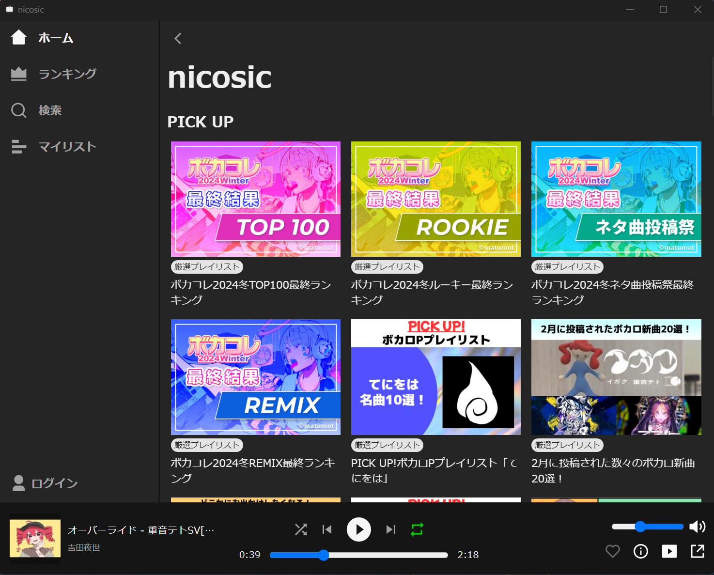

# nicosic


Music Player Application for niconico.
Built using Electron, Express and React.



## Download

You can download the latest release of nicosic from the [Release Page](https://github.com/Negima1072/nicosic/releases/latest).


## Usage

### Development

```bash
npm install
npm run dev
```

### Production

```bash
npm install
npm run build
npm run start
```

## License

The code parts of this project are licensed under the [MIT License](https://github.com/Negima1072/nicosic/blob/main/LICENSE).
